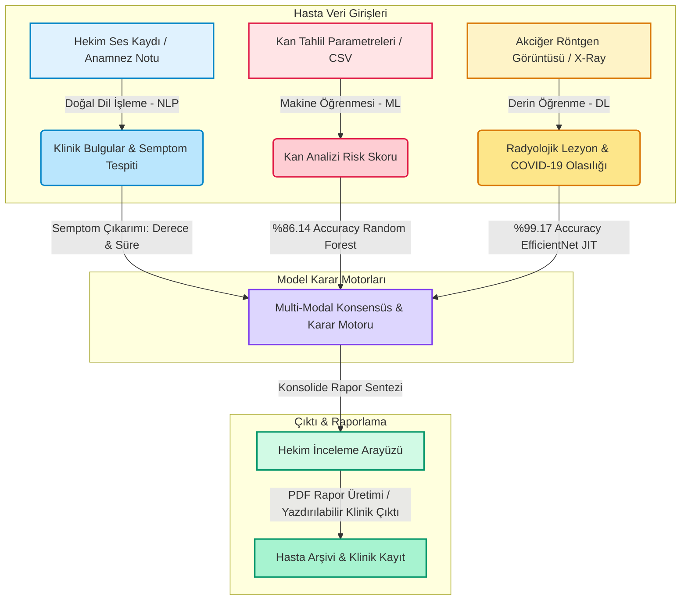

# 🩻 TanıSentez CDSS: Çoklu Modalite Yapay Zeka Destekli Klinik Karar Destek Platformu

[](https://fastapi.tiangolo.com/)
[](https://react.dev/)
[](https://tailwindcss.com/)
[](https://pytorch.org/)
[](https://scikit-learn.org/)

**TanıSentez CDSS (Clinical Decision Support System)**, hekimlerin klinik teşhis ve karar alma süreçlerini hızlandırmak, tanı doğruluk payını artırmak ve çok boyutlu verileri tek bir merkezde birleştirmek amacıyla geliştirilmiş **Çoklu Modalite (Multi-Modal)** tıbbi analiz platformudur. 

Sistem; hastanın serbest metin veya ses formundaki **klinik anamnez öyküsünü (NLP)**, **kan tahlili parametrelerini (Random Forest)** ve **radyolojik akciğer röntgenlerini (EfficientNet)** eş zamanlı ve senkronize olarak işleyerek konsolide (bütünleşik) bir klinik durum raporu ve risk skoru üretir.

---

## 📐 Sistem Mimarisi & Çoklu Modalite İş Akışı

Sistemin temel çalışma felsefesi, farklı kanallardan (modalitelerden) gelen dağınık tıbbi verileri sentezleyerek hekime konsensüs kararı sunmaktır. Bu iş akışı aşağıdaki şemada gösterilmiştir:



---

## ✨ Temel Modüller ve Yapay Zeka Yetenekleri

### 1. 🗣️ Türkçe Klinik NLP (Doğal Dil İşleme)
Hekimin sisteme girdiği Türkçe serbest metin veya mikrofon yardımıyla gerçekleştirdiği **ses kayıtları** (Web Speech API entegrasyonuyla) anlık olarak metne dönüştürülerek NLP analizine tabi tutulur:
* **Akıllı Pencereleme (Local Context Window):** Algoritma, tespit ettiği klinik anahtar kelimenin etrafında **120 karakterlik dinamik bir yerel pencere** oluşturarak semptomun bağlamını okur.
* **Semptom Tespiti:** *Öksürük, Ateş, Nefes Darlığı, Baş Ağrısı, Halsizlik, Kas Ağrısı, Boğaz Ağrısı, Tat/Koku Kaybı* gibi kritik semptomlar ve bunların tıbbi eşanlamlıları regex kuralları ile çıkarılır.
* **Şiddet & Süre Analizi:** Tespit edilen semptomların şiddeti (*Şiddetli, Hafif, Orta*) ve süresi (*örn: 4 gün, dünden beri*) Türkçe dil kalıpları analiz edilerek raporlanır.

### 2. 🩸 Kan Tahlili Risk Analiz Motoru (Makine Öğrenmesi)
Kan tahlili sonuçları doğrudan form üzerinden girilebildiği gibi, laboratuvar çıktısı olan **CSV formatındaki dosyaların** sisteme yüklenmesiyle de otomatik olarak parser edilerek alanlara doldurulabilir.
* **Model:** Optimize edilmiş **Random Forest Classifier** (`sklearn`) modeli.
* **Girdiler:** Hastanın yaşı, Lökosit (WBC), Trombosit (Platelets), Monosit, CRP ve Eozinofil değerleri.
* **Normalizasyon:** Model, verileri eğitildiği Z-Score normalizasyonu veya özelleştirilmiş scaler katmanından geçirerek standardizasyon sağlar.
* **Doğruluk Metriği:** Model test kümesinde **%86.14 Genel Doğruluk (Accuracy)** oranına sahiptir.

### 3. 🩻 Derin Öğrenme ile Radyoloji İncelemesi (Deep Learning)
Klinik tablosunda tahlil analizi tamamlanan hastaların radyolojik akciğer grafileri (Röntgen) sisteme yüklenerek anında işlenir:
* **Model:** PyTorch ile eğitilmiş ve CPU üzerinde yüksek hızda çalışması için TorchScript formatına (`.pt`) dönüştürülmüş **EfficientNet** derin öğrenme modeli.
* **Görüntü Ön İşleme:** Görseller PyTorch JIT pipeline'ı vasıtasıyla `224x224` boyutlarına yeniden ölçeklendirilir ve ImageNet dağılımları (`mean=[0.485, 0.456, 0.406]`, `std=[0.229, 0.224, 0.225]`) temel alınarak normalize edilir.
* **Doğruluk Metriği:** Model test setinde **%99.17 gibi üst düzey bir Doğruluk (Accuracy)** başarısına sahiptir.

---

## 🛠️ Teknolojik Altyapı ve Bağımlılıklar

### Backend (FastAPI / Python)
* **Asenkron Altyapı:** Uvicorn tabanlı, yüksek performanslı FastAPI framework.
* **State Management:** Yapay zeka modelleri sunucu başlarken (`@app.on_event("startup")`) bir kez RAM'e yüklenir, böylece her istekte diske erişim engellenerek milisaniyeler seviyesinde çıkarım (inference) hızı elde edilir.
* **Kütüphaneler:** `torch`, `torchvision`, `scikit-learn`, `joblib`, `pandas`, `pillow`, `pydantic`, `python-multipart`.

### Frontend (React 19 / TypeScript)
* **Modern Derleyici & Sunucu:** Vite desteğiyle HMR (Hot Module Replacement) ile ultra hızlı geliştirici deneyimi.
* **Stil & UI:** Tailwind CSS v4 ile geliştirilmiş tamamen responsive (mobil ve masaüstü uyumlu), klinik odaklı, göz yormayan, premium bir hekim arayüzü.
* **Klinik İkonografi:** Pürüzsüz vektörel (SVG) tıbbi ikon kütüphanesi.
* **Yazıcı Dostu:** Raporlama çıktı ekranı `window.print()` için özel CSS kurallarıyla optimize edilmiş olup hekimin tek tuşla resmi tıbbi rapor alabilmesini sağlar.

---

## 🚀 Hızlı Kurulum & Çalıştırma

Projeyi yerel makinenizde çalıştırmak için aşağıdaki adımları sırasıyla uygulayabilirsiniz:

### Ön Gereksinimler
* Bilgisayarınızda **Node.js (v18+)** ve **Python (3.9+)** yüklü olmalıdır.

---

### 1. Backend (FastAPI) Sunucusunun Başlatılması

```bash
# Proje ana dizinindeyken backend klasörüne gidin
cd backend

# Sanal ortam (venv) oluşturun (Tavsiye edilir)
python -m venv venv

# Sanal ortamı aktif edin
# Windows için:
venv\Scripts\activate
# macOS/Linux için:
source venv/bin/activate

# Gerekli paketleri yükleyin
pip install -r requirements.txt

# API sunucusunu başlatın
uvicorn main:app --reload --port 8000
```
* **API Adresi:** `http://localhost:8000`
* **Etkileşimli Swagger Dokümantasyonu:** `http://localhost:8000/docs`

---

### 2. Frontend (React) Arayüzünün Başlatılması

```bash
# Proje ana dizinindeyken frontend klasörüne gidin (Yeni bir terminalde)
cd frontend

# Paketleri yükleyin
npm install

# Projeyi geliştirici modunda çalıştırın
npm run dev
```
* **Arayüz Adresi:** `http://localhost:5173` (Vite tarafından atanan portu terminalden kontrol edebilirsiniz)

---

## 📂 Proje Klasör Yapısı

```text
TanıSentez/
├── backend/                  ← FastAPI tabanlı asenkron Python sunucusu
│   ├── main.py               ← API endpointleri, Türkçe Klinik NLP ve AI çıkarımları
│   ├── requirements.txt      ← Python paket bağımlılıkları
│   └── modeller/             ← Eğitilmiş Yapay Zeka Model Ağırlıkları
│       ├── covid_tahlil_modeli.pkl     ← Random Forest Kan Tahlil Modeli (%86.14 Acc)
│       └── covid_image_scripted.pt     ← TorchScript EfficientNet Röntgen Modeli (%99.17 Acc)
│
├── frontend/                 ← React 19 + TypeScript + Tailwind CSS v4 arayüzü
│   ├── package.json          ← Node.js paket bağımlılıkları
│   ├── vite.config.ts        ← Vite sunucu ve derleme ayarları
│   └── src/                  
│       ├── main.tsx          ← Uygulama giriş noktası
│       ├── App.tsx           ← Ana CDSS yönetim ekranı ve klinik formlar
│       ├── App.css           ← Yazıcı dostu çıktılar ve genel stil tanımlamaları
│       └── assets/           ← Arayüz için görsel varlıklar
│
├── COVID_Rontgen_Test.jpg    ← Testlerde kullanılmak üzere pozitif akciğer röntgeni
├── Normal_Rontgen_Test.jpg   ← Testlerde kullanılmak üzere sağlıklı akciğer röntgeni
├── tahlil_dusuk_risk.csv     ← Otomatik form doldurmak için örnek Düşük Risk tahlil CSV'si
├── tahlil_orta_risk.csv      ← Otomatik form doldurmak için örnek Orta Risk tahlil CSV'si
├── tahlil_yuksek_risk.csv    ← Otomatik form doldurmak için örnek Yüksek Risk tahlil CSV'si
└── .gitignore                ← Depoyu temiz tutan root Git ayar dosyası
```

---

## ⚕️ Klinik Yasal Sorumluluk Reddi (Disclaimer)

> [!WARNING]
> **TanıSentez CDSS**, tıbbi uzmanlar ve hekimler için **karar destek sistemi (ikinci bir görüş)** olarak tasarlanmıştır. Sistem tarafından üretilen risk skorları, semptom analizleri ve öneriler tanısal kesinlik taşımaz.
>
> Klinik tablodaki nihai teşhis, tedavi yönetimi, ilaç reçeteleme ve tüm tıbbi müdahale kararları **tamamen uzman hekimin sorumluluğundadır.** Platformun sunduğu tahminler klinik bulgularla desteklenmeli ve hekim süzgecinden geçirilmelidir.
